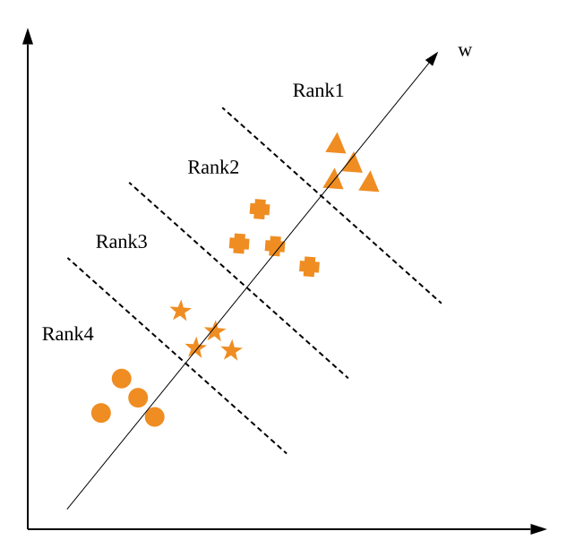

# Summary
Code generation is the task of parsing natural language statements into source code like Python. Neural code generation models like TranX (Yin and Neubig, 2018) generate hypotheses by beam search and output the code with highest score, which however is not necessarily the best one. In this work, we propose a re-rank based framework which aims at re-ranking these hypothesis candidates. A classifier is trained to re-rank candidates using neural based and hand-crafted features. While our re-rank framework can be easily generalized to other code generation models or natural language related tasks such as machine translation, we extend TranX with our framework and demonstrate its effectiveness on CoNaLa (Yin et al., 2018a) and Django (Oda et al., 2015a) dataset. Experiments show that our LeToRr framework improves the SOTA performance by **+3.4** ACC and **+4.6** BLEU on Django dataset.

# Introduction
Code generation is the task of parsing natural language utterances into source code written in general programming language, e.g., Python.
Natural language to code (NL2Code) is a challenging NLP task for several reasons:
1. Natural language (NL) as the input is highly unstructured, while source code as the output needs to be well-structured. One can describe the intention in NL in different ways. There can also be several corresponding source code snippets to achieve the same intention.
2. It is non-trivial to model the semantics and underlying knowledge of a general programming language.
3. Neural model training is data hungry. While it is easy to obtain natural language intentions or code snippets, it is hard to obtain (NL intention, code snippet) pairs that have one to one correspondence.

Recently, several neural based approaches have been proposed to solve the code generation task. A brief survey of these models are covered in Section \ref{sec:related}, and detailed literature review is in Appendix. Among them, TranX (Yin and Neubig, 2018) is a transition-based neural abstract syntax parser that achieves state-of-the-art results on several code generation tasks. It enforces the output to be well-formed by representing code as ASTs and using neural networks to generate action sequences to construct such ASTs. TranX and many other neural code generation models generate hypotheses by beam search and output the generated code with highest score.
However, the hypothesis that the model has most confidence in is not necessarily the best one. For example, as shown in Tabel 1, we observe that for hypotheses generated by TranX, the top-k (oracle) hypotheses BLEU score can be 12\% higher than the top-1 BLEU score on CoNaLa dataset. By re-ranking these hypotheses candidates, it is expected to obtain a better result.

|             | CoNaLa |
|-------------|--------|
| BLEU        | 23.99  |
| Oracle BLEU | 35.55  |

<h4 align="center"> Table 1. Gap between top-1 and oracle on Conala dataset using TranX </h4>

|                 | Django |
|-----------------|--------|
| Accuracy        | 76.73  |
| Oracle Accuracy | 83.10  |
| BLEU            | 83.49  |
| Oracle BLEU     | 88.17  |

<h4 align="center"> Table 2. Gap between top-1 and oracle on Django dataset using TranX </h4>

In this paper, we propose a re-rank based framework which aims at re-ranking these hypothesis candidates.Besides the main neural model that generates code snippets given NL input, we also use neural models to annotate code with NL, compute the text similarity between NL input and code snippet, as well as the likelihood of a code snippet. We also use hand-crafted features such as code / action length prediction. A classifier is then trained to re-rank candidates using these neural based and hand-crafted features described above.
We cover the details of our re-rank based framework in Section \ref{sec:rerank}.

Our re-rank based framework has the following properties:
- **Generalization ability**: while we only extend TranX with our framework, it is a general ranking framework that can be easily generalized to other code generation models or related tasks such as machine translation.
- **Extensibility**: our framework can be extended by incorporating more features and potentially achieving better performance.
- **Effectiveness**: we demonstrate its effectiveness by achieving state-of-the-art results on CoNaLa (Yin et al., 2018a) and Django (Oda et al., 2015a) dataset, which is detailed in Section 5.

Considering the data hungry problem, we also explored data augmentation approaches such as bootstrapping, which is covered in Section 4.

# Related Work
## Semantic Parsing
Semantic parsing aims at translating natural language (NL) into machine-executable logical forms or programs, and thus are key components in NL understanding systems. The task of code synthesis or code generation can be considered as a type of semantic parsing with the goal to map sentences in natural language to a formal representation with the underlying meaning (Mooney, 2014). In the last two years, the models used for semantic parsing have changed dramatically, with the introduction of neural methods that allow for rethinking a number of the previous assumptions underlying semantic parsing. Especially, sequence-to-sequence (seq2seq) models have achieved state-of-the-art results in code generation. These work include (Jia and Liang, 2016), (Locascio et al., 2016), (Ling et al., 2016), (Iyer et al., 2017), (Zhong et al., 2017), (Rabinovich et al., 2017), (Lin et al., 2017). On the other hand, different traditional sequence model, another direction is to use tree structure to represent code with the hope to incorporate the syntactical knowledge of the code (Hayati et al., 2018) (Rabinovich et al., 2017) (Yin and Neubig, 2017) . Following this direction, Yin and Neubig (2018) proposed a transition based framework TranX, which is the SOTA method of neural code generation of Python. TranX is transition based neural semantic parser that maps NL utterances into formal meaning representations (MRs). The key idea of TranX is that it uses a transition system based on the abstract syntax description language (ASDL) for the target MR. This brings two advantages: first, the grammar model could explicitly capture the target syntax as prior knowledge, which can help constrain the output space and model the information flow, and second, it is highly generalizable, and can easily be applied to any other type. However, it is not trivial to represent code as a tree due to the significant number of nodes in the tree compared to the length of the NL description. Based on this observation, Hayati et al. (2018) proposed a framework RECODE, which is an adaptation of retrieval-based neural machine translation method (Zhang et al., 2018) to
the code generation problem by expanding it to apply to generation of tree structures. Recently, (Dong and Lapata, 2018) proposed a Coarse-to-Fine framework which first generates a rough sketch of meaning of input natural language utterance, and then fills in details. Their model is regarded as current state-of-the-art approach in code generation.

## Learning to Rank
Learning to rank (LoTR) has been applied to a wide range of applications in Natural Language Processing (NLP), Data Mining (DM) and Information Retrieval (IR). It has demonstrated its effectiveness in document retrieval, collaborative filtering, document summarization, machine translation, and question answering (Li, 2011a).  In the context of document retrieval, given a query, the system which maintains a collection of documents, retrieves documents relevant to the query from the collection, ranks the documents, and returns the top ranked documents. The ranking task is performed by using a ranking model f(q,d) to sort the documents, where q denotes a query and d denotes a document. Current trend is to utilize machine learning techniques to automatically construct the ranking model f(q, d). Similarly, in the context of code generation, the candidate hypothesis h is analogous to document, and the given natural language n is analogous to the query, so the ranking model in code generation is formulated as f(h, n). 

**Pointwise Approach**: In the pointwise approach, the ranking problem is converted to regression or ordinal classification, where the group structure of ranking is therefore ignored. The pointwise approach includes Subset Ranking McRank (Li et al., 2008), (Cossock and Zhang, 2006), Prank (Crammer and Singer, 2002), and OC SVM (Shashua and Levin, 2003).

**Pairwise Approach**: In the pairwise approach, ranking is transformed into pairwise classification or pairwise regression. It only cares about the relative order of each pair and thus ignores the global ordering. In terms of the classification, a classifier (normally a binary classifier) for classifying the ranking orders of pairs is created and is employed in the ranking of documents. The pairwise approach includes Ranking SVM (Herbrich, 2000), RankBoost (Freund et al., 2003), RankNet (Burges et al., 2005), GBRank (Zheng et al., 2008), IR SVM (Cao et al., 2006), LambdaRank (Burges et al., 2007), and LambdaMART (Wu et al., 2010).

**Listwise Approach**: The listwise approach addresses the ranking problem in a more straightforward way. Specifically, it takes ranking lists as instances in both learning and prediction. The group structure of ranking is maintained and ranking evaluation measures can be more directly incorporated into the loss functions in learning. The listwise approach includes ListNet (Cao et al., 2007), ListMLE (Xia et al., 2008), AdaRank (Xu and Li, 2007), SVM MAP (Yue et al., 2007), and Soft Rank (Taylor et al., 2008).

Apart from traditional classifiers mentioned above, neural-based ranking becomes popular again recently. Recent work includes Deep Structured Semantic Models (DSSM) (Huang et al., 2013), Deep Relevance Matching Model (DRMM) (Guo et al., 2016), Kernel-Based Neural Ranking Model (K-NRM) (Xiong et al., 2017). These neural models require fewer hand-crafted features and functions, but need more complicated methods for combining evidence and weights, and need more parameters.

# Learning to Re-rank
As introduced above, the system is given one natural language utterance which describes the intent and several decoded hypotheses which are generated from the up-streaming translator. Normally, the up-streaming translator will assign each candidate with a confidence score. The goal is to derive several qualitative criteria over the candidate hypothesis to re-rank them based on the given confidence score and any other features. In the context of machine learning, the re-ranker is learnt from a labeled training dataset and expected to generalize to unseen dataset. However, since there lacks such dataset that has ranked hypotheses, we use an intermediate medium to indirectly derive the ordering of hypothesis. Specifically, we calculate the BLEU score between each hypothesis and the gold target code, and use this BLEU score to rank each candidate hypothesis.

Figure 6 shows an overview of our TranX + Re-ranking architecture. The design of re-rank classifier is discussed from sub-section 3.1 to 3.3 and feature extraction in sub-section 3.4.

<h4 align="center"> Figure 6. Architecture </h4>

## Pairwise Approach
In terms of pairwise re-ranking, each ranking of n hypothesis candidates is decomposed to n * (n − 1) pairs. Each pair is the ranking between two candidates and forms a training instance for the classifier. We have experimented with two different re-rankers, one is classification based Ranking support vector machine (SVM) (Herbrich, 2000) and the other is support vector regression (SVR) (Drucker et al., 1997).

### Ranking SVM
Figure 1 gives an example of ranking problem. Assume there are four ranks and the weight vector w corresponds to the linear function f(x) = ⟨w, x⟩ which can score and rank the candidates. Using function f to rank candidates is analogous to projecting candidates into a vector and sorting them according to the projection on the vector.

<h4 align="center"> Figure 1. Ranking Problem </h4>

<h4 align="center"> Figure 2. Ranking SVM </h4>

Figure 2 shows that the ranking problem in Figure 1 can be converted to linear SVM classification problem. The differences between feature vector representations of any pair among the candidates are treated as new data point represented in the form of feature vector. Further more, the label to each new data point is therefore set as:

For example, h1 − h2 and h2 − h1 are corresponding positive and negative samples respectively. The weight vector w of the SVM classifier corresponds to the ranking function. The Ranking SVM can be formalized as quadratic programming:

where

where $h_i^{(1)}$ and $h_i^{(2)}$ are the feature vectors in a pair, $\left \| \cdot  \right \|$ denotes $L_2$ norm, m is the total number of training samples, and $C > 0$ is a coefficient. It is equivalent to the non-constrained optimization function which minimizes the regularized hinge loss function:

where $\lambda = \frac{1}{2C}$ (Li, 2011b).

After training the binary classifier, the simplest way to re-rank each candidate is by the number of other candidates it beats. For n hypothesis candidates in total, the rank ri of hypothesis hi is:

The intuition is that the hypothesis which wins the most pairwise comparisons should be considered as the overall winner.

One of the problems seen in previous work (Avramidis, 2012) is that the aforementioned scoring would result in ties easily if the re-ranker cannot distinguish the pair, especially in the case where each pair creates two training samples (i.e., one positive and one negative). This observation encourages us to use SVR approach.

### SVR
One motivation for using regression-based re-ranker is that not all of binary classification decisions are equally important. The hypothesis candidate that has the same number of wins with higher confidence should be re-ranked higher than that of lower confidence. In the context of Ranking SVM, the simple binary decision loses this signal. Therefore, for regression-based pair-wise re-ranking, the rank ri of hypothesis hi is:

where $\Delta_{i,j}$ is the output of the regression ranged from 0 to 1 which evaluates rank margin between two hypotheses - 1 corresponds to absolutely ranked higher and 0 corresponds to absolutely ranked lower, analogous to binary decision in Ranking SVM. In detail, the label of each pair is set to:

where si > sj, where si is the BLEU score between hi and gold code. This normalized score difference quantifies how much hi should be ranked above hj .

## Pointwise Approach
In terms of pointwise re-ranking, we have experimented with both classification-based and regression-based approaches.

### Large Margin SVM-based Classification
The OC-SVM based two approaches proposed by (Shashua and Levin, 2003) use the large margin principle. One is analogous to generalization of v-SVM (Scho ̈lkopf et al., 2000) to LeToR where the margin of the closet neighbouring rankings is maximized. The other aims at maximizing the sum of n − 1 different margins. They are proven to be better than ordinal regressions and multi-class SVM when applied for ranking (Shashua and Levin, 2003).

<h4 align="center"> Figure 3. OC-SVM </h4>

### Regression
For regression-based pointwise re-ranking, we experimented with Linear Regression to directly predict the BLEU score of each candidate hypothesis, and base on it to re-rank.

## Listwise Approach
In listwise re-ranking, we experimented with XGBoost-based LambdaRank (Burges et al., 2007) using NDCG metric. LambdaRank is an improved version of RankNet (Burges et al., 2005), which shares the core idea of RankNet but achieves better performance. The cost function for RankNet aims to minimize the number of inversions in ranking. An inversion means an incorrect order among a pair of results, i.e. a low rated hypothesis is ranked higher than a high rated hypothesis. LambdaRank attempts to address one problem of RankNet that the loss function of RankNet dose not always match all measure metrics.

### Evaluation Metrics
In listwise ranking, it is necessary to evaluate the goodness of a ranking against the oracle ranking. Several popular evaluation metrics are used in IR, and we think they can be applied well to re-ranking in our case. These metrics include Discounted Cumulative Gain (DCG) (Jarvelin and Kekalainen, 2000), Normalized Discounted Cumulative Gain (NDCG), Mean Average Precision (MAP), and Kendalls Tau.

#### DCG
Given a natural language intent ui and decoded candidate hypotheses set Hi, denote the ranking list on Hi based on initial confidence scores from decoder as Ri, and Yi as the oracle ranking based on BLEU score of each hypothesis. DCG at rank j is defined as :

where Gi (·) denotes the gain function and Di (·) denotes a rank discount function. It is the cumulative gain of accessing the information from position 1 to position j. Normally, the gain function is chosen to be the exponential function of rank, which implies that the satisfaction of accessing information exponentially increases when the rank of relevance of information increases (Li, 2011b).

where yi,k is the rank of hypothesis hk in the ranking ri. The discount function is usually defined as a logarithmic function of rank, which implies that the satisfaction of accessing information logarithmically decreases when the rank of access increases.

#### NDCG
NDCG is normalized version of DCG:

where Gmax,i (j ) denotes the normalizing factor which makes top 1 NDCG score of perfect rank ri* is 1. In summary, NDCG and DCG both tend to assign high scores to the ranking lists where relevant candidates are ranked high. For ideal or perfect rankings, the NDCG value at each position is always one, while for imperfect rankings, the NDCG values are usually less than one.

#### MAP
MAP is averaged (over queries) version of Average Precision (AP):

where label yi,j is a binary classification indicates whether the candidate is correct or not, and P(j) for intent uj is defined as:

P(j) is the precision until the position of hi,j for ui.
MAP is further averaged over intents based on AP.

## Features
In this part, we discuss how neural based and hand-crafted features are extracted for re-ranking.

### Code Re-annotation
Code annotation is the task of describing code snippets in NL statement. Intuitively, we should assign generated code which can be re-annotated with similar NL intention with higher score. We use the model from (Yin et al., 2018c), which is a sequence-to-sequence network (Luong et al., 2015) with attention (Bahdanau et al., 2014) and copy mechanism (Vinyals et al., 2015) that models P r(NL | Code).

The probability of generating ith word wi given code c and previous words w1...i−1 is as follows:

where:

### (NL, Code) Similarity
Another idea is to model the joint probability distribution P r(NL, Code). Therefore we can adapt models from related NLP areas such as Sentence Similarity, Natural Language Inference, Paraphrase Identification and Alignment in Machine Translation.

Specifically, we use Doc2Vec (Le and Mikolov, 2014) to extract sentence vectors and compute their distance using cosine similarity.

<h4 align="center"> Figure 3. Doc2Vec (Le and Mikolov, 2014) </h4>

### Code Likelihood
We can also train a language model to compute the likelihood of generated code. The training process is unsupervised, therefore data are easy to obtain. Specifically, a standard LSTM language model (Zaremba et al., 2014) is used to model P r(Code):

where a code snippet is represented as a sequence of tokens. At ith RNN time step, the model computes the probability for generating the ith token token:

where hi is the hidden state at ith time step.

### Hand-crafted Features
We tried several hand craft features and found features dealing with length to be most effective.

Empirically, normal beam search will favor shorter candidates over longer ones since at each time step, a negative log probability is added, yielding lower scores for longer candidates. Therefore, we introduce code length normalization score by normalizing the output score by generated code length. To obtain action length normalization score, we do the same but normalize by generated action sequence length.

Inspired by (Wu et al., 2016), we also normalize by the following scalar:

where Y can be generated code length or generated action sequence length and α is an empirical constant (α ∈ [0.6, 0.7] was usually found to be best).

We can also predict code or action length statistically by computing target code or action length distribution given length of NL input, i.e.,

where $N_{l_{out} \, | \, l_{in}}^{(o)}$  is the number of target output with length $l_{out}$ given input length is $l_{in}$, $N_{l_{in}}^{(i)}$ is the number of input with length $l_{in}$ and $\alpha$ is the smoothing factor.

# Data Augmentation
For a complex task like python code generation, 2379 well-annotated training samples are far from enough, especially considering the rich grammatical features of python language, along with various kinds of third-party modules. There are two main challenges in CoNaLa dataset:
- The 2379 annotated samples only cover a subset of python grammars. Some other grammatical features and many third-party modules usages are not included.
- For each independent intent, there's only very few (usually one) NL\&Code pair addressing it, leading to the lack of generalization. That is, the model tends to learn an one-to-one mapping between each NL\&Code pair, while ideally we want it to learn the semantic meaning of the natural language utterance regardless of the specific words that are used and generate the code from that semantic meaning instead of the natural language utterance.

For first problem, we try to use transfer learning to tackle it. For second problem, we propose a novel bootstrapping strategy to obtain more data from the mined 600K dataset from StackOverflow.

## Domain Adaption
Domain adaption is a type of transfer learning where output is the same, but with different types of topics of input. It is proved to be very effective when training data of one task is easily outdated or hard to obtain (Pan and Yang, 2010). In CoNaLa challenge, we use Django dataset to pretrain our model for the purpose of transferring domain knowledge of Python language. Then adapt the domain to CoNaLa dataset.

One thing to notice is that although Django dataset and CoNaLa dataset are both for python code generation, their annotation style is quite different. The annotation of Django dataset is more like a paraphrase of the code itself in natural language form, while that of CoNaLa is in a very descriptive and succinct generalization form.

## Bootstrapping
Bootstrap is a popular technique in NLP which can be used to obtain more data from a large unannotated corpus based on a small set of well-annotated data known as seed. We adapt a standard bootstrap procedure to CoNaLa dataset in order to find more semantically similar data pairs to each sample in the well-annotated 2379 training data. By cross matching the discovered data with the seed, we can create more samples with similar semantic intent but in a different way of describing such intent. Theoretically it can improve the generalization of our model since it forces the model to learn the mapping from different natural language utterances to the same code snippet. Algorithm 1 pseudo-code briefly describe the procedure.

Both text-based similarity and semantic similarity are used when filter out discovered data. Text-based similarity is just the classic Levenshtein edit distance. Semantic similarity is based on doc2vec. By comparing cosine similarity between vectors of two natural language utterances, we can filter out sentences which are similar in text-level but is very divergent semantically.

Figure 5 gives an example of how bootstrap creates three more samples from one seed. With the newly found sample, two natural language utterances and two code snippets are cross matched, which gives us four samples. Given n bootstrapped data, we can get (n+1)^2 - 1 additional samples via cross matching.

<h4 align="center"> Figure 5. bootstrap examples </h4>

# Experiments
Table 3 and Table 4 show the performance gain of different re-rankers. It is observed that pairwise SVR based re-ranker achieves best performance gain from original BLEU score of **24.77** to **33.51** after re-ranking on CoNaLa dataset, and from accuracy of **76.73** to **81.33** on Django.

<h4 align="center"> Table 3. Comparison of different re-rankers on CoNaLa </h4>

<h4 align="center"> Table 4. Comparison of different re-rankers on Django </h4>

<h4 align="center"> Table 5. Performance gain of pairwise SVR-based re-ranking on CoNaLa </h4>

As shown in Table 6 and Table 7, our LeToRr framework achieves state-of-the-art performance of **33.5 BLEU** score on CoNaLa **81.33 accuracy** on Django.

|        | BLEU  |
|--------|-------|
| TranX  | 24.77 |
| LeToRr | 33.51 |

<h4 align="center"> Table 6. CoNaLa results </h4>

<h4 align="center"> Table 7. DJANGO results </h4>

## Failed Attempts
**BERT**: According to (Devlin et al., 2018), Bidi- rectional Encoder Representations from Transformers (BERT), a modified version of original Transformer encoder (Vaswani et al., 2017), is designed to pre-train deep bidirectional representations by jointly conditioning on both left and right context, and thus the pre-trained BERT representations can be fine-tuned with down-streaming applications to create state-of-the-art models for a wide range of tasks. Motivated by this, we supposed that we could use pre-trained BERT to extract contextualized embedding from input natural language utterances. Suggested by (Devlin et al., 2018), we concatenated the token representations from top four hidden layers of pre-trained BERT as word embedding, and replaced the original word embedding with BERT word embedding. During training stage, we froze the BERT layer so that it will not participate in training. However, it turns out the performance of the model becomes worse after using pre-trained BERT as embedding layer. We think this can be explained by the fact that BERT is a Transformer encoder, so the probably correct approach should be replacing the encoder in the original seq2seq architecture with BERT rather than brute-forcely use BERT as word embedding layer. Moreover, since BERT is specially designed for extracting contextual information from input natural language, it functions duplicately with the original attention-based encoder-decoder architecture of TranX, and thus it brings counteractive effect. Moreover, due to its context-dependent nature, different words under different contexts will have different word embeddings, and this might not be desirable by the existing model.

## Observation and thoughts
We observe that the upperbound of our LeToRr framework is not the original BLEU score but oracle BLEU score. This is intuitive as the nature of re-ranking limits the best improvement it can bring to the oracle corpus BLEU. However, it also proves that our LeToRr works relatively independently of the original ranking, which means our framework could be easily adapted to other up-streaming MT framework. 

Some of common metrics used in IR, such as MAP and NDCG, are not perfectly appropriate for re-ranking in MT, especially code generation in our case, as we only care about the top 1 candidate. The ordering below is not of much value for tasks like MT. 

# Future Work
We plan to further investigate in the following directions:

- Fine-tune existing features and incorporate more features for re-ranking. For example, we can introduce the running output of code as a weakly supervised feature and compare results of generated code to gold standard.
- Generalize this re-rank framework to other code generation or machine translation tasks.
- Propose more ways to overcome data-hungry problem as high quality code annotation dataset is still hard and expensive to obtain.
- An interesting though preliminary idea is to tackle code annotation and code generation tasks at the same time. We may co-train code annotation and code generation models jointly as they are inverse task to each other.

# Conclusion
Observed the gap between top-k score and top-1 score of hypothesis candidates, we proposed a re-rank based framework to re-select the best candidate generated by code generation model. We extend TranX with our framework and demonstrate its effectiveness by achieving state-of-the-art results on two code generation tasks CoNaLa and Django.

# Acknowledgements
We gratefully thank the author of TranX (2018), Pengcheng Yin, for his insightful discussion and open source TranX and StructVAE (2018c) implementation.

# Reference
Eleftherios Avramidis. 2012. Comparative quality estimation: Automatic sentence-level ranking of multiple machine translation outputs. Proceedings of COLING 2012, pages 115–132.

Dzmitry Bahdanau, Kyunghyun Cho, and Yoshua Bengio. 2014.Neural machine translation by jointly learning to align and translate. arXiv e-prints, abs/1409.0473.

Matej Balog, Alexander L Gaunt, Marc Brockschmidt, Sebastian Nowozin, and Daniel Tarlow. 2016. Deepcoder: Learning to write programs. arXiv preprint arXiv:1611.01989.

Robert Balzer. 1985. A 15 year perspective on automatic programming. IEEE Transactions on Software Engineering, (11):1257–1268.

Antonio Valerio Miceli Barone and Rico Sennrich. 2017. A parallel corpus of python functions and documentation strings for automated code documentation and code generation. arXiv preprint arXiv:1707.02275.

Jonathan Berant, Andrew Chou, Roy Frostig, and Percy Liang. 2013. Semantic parsing on freebase from question-answer pairs. In Proceedings of the 2013 Conference on Empirical Methods in Natural Language Processing, pages 1533–1544.

Christopher Burges, Tal Shaked, Erin Renshaw, Ari Lazier, Matt Deeds, Nicole Hamilton, and Gregory N Hullender. 2005. Learning to rank using gradient descent. In Proceedings of the 22nd International Conference on Machine learning (ICML-05), pages 89–96.

Christopher J Burges, Robert Ragno, and Quoc V Le. 2007. Learning to rank with nonsmooth cost functions. In Advances in neural information processing systems, pages 193–200.

Yunbo Cao, Jun Xu, Tie-Yan Liu, Hang Li, Yalou Huang, and Hsiao-Wuen Hon. 2006. Adapting ranking svm to document retrieval. In Proceedings of the 29th annual international ACM SIGIR confer- ence on Research and development in information retrieval, pages 186–193. ACM.

Zhe Cao, Tao Qin, Tie-Yan Liu, Ming-Feng Tsai, and Hang Li. 2007. Learning to rank: from pairwise approach to listwise approach. In Proceedings of the 24th international conference on Machine learning, pages 129–136. ACM.

David Cossock and Tong Zhang. 2006. Subset ranking using regression. In International Conference on Computational Learning Theory, pages 605–619. Springer.

Koby Crammer and Yoram Singer. 2002. Pranking with ranking. In Advances in neural information processing systems, pages 641– 647.

Jacob Devlin, Ming-Wei Chang, Kenton Lee, and Kristina Toutanova. 2018. Bert: Pre-training of deep bidirectional transformers for language understanding. arXiv preprint arXiv:1810.04805.

Li Dong and Mirella Lapata. 2016. Language to logical form with neural attention. arXiv preprint arXiv:1601.01280.

Li Dong and Mirella Lapata. 2018. Coarse-to-fine decoding for neural semantic parsing. arXiv preprint arXiv:1805.04793.

Harris Drucker, Christopher JC Burges, Linda Kaufman, Alex J Smola, and Vladimir Vapnik. 1997. Support vector regression machines. In Advances in neural information processing systems, pages 155–161.

Yoav Freund, Raj Iyer, Robert E Schapire, and Yoram Singer. 2003. An efficient boosting algorithm for combining preferences. Jour- nal of machine learning research, 4(Nov):933–969.

Jiatao Gu, Zhengdong Lu, Hang Li, and Victor O. K. Li. 2016. Incorporating copying mechanism in sequence-to-sequence learning. CoRR, abs/1603.06393.

Jiafeng Guo, Yixing Fan, Qingyao Ai, and W Bruce Croft. 2016. A deep relevance matching model for ad-hoc retrieval. In Proceedings of the 25th ACM International on Conference on Information and Knowledge Management, pages 55–64. ACM.

Tihomir Gvero and Viktor Kuncak. 2015. Interactive synthesis using free-form queries. In 2015 IEEE/ACM 37th IEEE International Conference on Software Engineering, volume 2, pages 689–692. IEEE.

Shirley Anugrah Hayati, Raphael Olivier, Pravalika Avvaru, Pengcheng Yin, Anthony Tomasic, and Graham Neubig. 2018. Retrieval-based neural code generation. CoRR, abs/1808.10025.

Ralf Herbrich. 2000. Large margin rank boundaries for ordinal regression. Advances in large margin classifiers, pages 115–132.

Po-Sen Huang, Xiaodong He, Jianfeng Gao, Li Deng, Alex Acero, and Larry Heck. 2013. Learning deep structured semantic models for web search using clickthrough data. In Proceedings of the 22nd ACM international conference on Information & Knowledge Management, pages 2333–2338. ACM.

Srinivasan Iyer, Ioannis Konstas, Alvin Cheung, Jayant Krishna-murthy, and Luke Zettlemoyer. 2017. Learning a neural semantic parser from user feedback. arXiv preprint arXiv:1704.08760.

Kalervo Jarvelin and Jaana Kekalainen. 2000. Ir evaluation methods for retrieving highly relevant documents. In Proceedings of the 23rd annual international ACM SIGIR conference on Research and development in information retrieval, pages 41–48. ACM.

Oriol Vinyals, Meire Fortunato, and Navdeep Jaitly. 2015. Pointer networks. In Advances in Neural Information Processing Systems, pages 2692–2700.

Qiang Wu, Christopher JC Burges, Krysta M Svore, and Jianfeng Gao. 2010. Adapting boosting for information retrieval measures. Information Retrieval, 13(3):254–270.

Yonghui Wu, Mike Schuster, Zhifeng Chen, Quoc V. Le, Mohammad Norouzi, Wolfgang Macherey, Maxim Krikun, Yuan Cao, Qin Gao, Klaus Macherey, Jeff Klingner, Apurva Shah, Melvin Johnson, Xiaobing Liu, Lukasz Kaiser, Stephan Gouws, Yoshikiyo Kato, Taku Kudo, Hideto Kazawa, Keith Stevens, George Kurian, Nishant Patil, Wei Wang, Cliff Young, Jason Smith, Jason Riesa, Alex Rudnick, Oriol Vinyals, Greg Corrado, Macduff Hughes, and Jeffrey Dean. 
2016. Google’s neural machine translation system: Bridging the gap between human and machine translation. CoRR, abs/1609.08144.

Fen Xia, Tie-Yan Liu, Jue Wang, Wensheng Zhang, and Hang Li. 2008. Listwise approach to learning to rank: theory and algorithm. In Proceedings of the 25th international conference on Machine learning, pages 1192–1199. ACM.

Chenyan Xiong, Zhuyun Dai, Jamie Callan, Zhiyuan Liu, and Russell Power. 2017. End-to-end neural ad-hoc ranking with kernel pooling. In Proceedings of the 40th International ACM SIGIR conference on research and development in information retrieval, pages 55–64. ACM.

Jun Xu and Hang Li. 2007. Adarank: a boosting algorithm for information retrieval. In Proceedings of the 30th annual international ACM SIGIR conference on Research and development in information retrieval, pages 391–398. ACM.

Ziyu Yao, Daniel S Weld, Wei-Peng Chen, and Huan Sun. 2018. Staqc: A systematically mined question-code dataset from stack overflow. arXiv preprint arXiv:1803.09371.

Pengcheng Yin, Bowen Deng, Edgar Chen, Bogdan Vasilescu, and Graham Neubig. 2018a. Learning to mine aligned code and natural language pairs from stack overflow. In 2018 IEEE/ACM 15th International Conference on Mining Software Repositories (MSR), pages 476–486. IEEE.

Pengcheng Yin, Bowen Deng, Edgar Chen, Bogdan Vasilescu, and Graham Neubig. 2018b. Learning to mine aligned code and natural language pairs from stack overflow. In International Conference on Mining Software Repositories, MSR, pages 476–486. ACM.

Pengcheng Yin and Graham Neubig. 2017. A syntactic neural model for general-purpose code generation. arXiv preprint arXiv:1704.01696.

Pengcheng Yin and Graham Neubig. 2018. TRANX: A transition-based neural abstract syntax parser for semantic parsing and code generation. In Conference on Empirical Methods in Natural Language Processing (EMNLP) Demo Track.

Pengcheng Yin, Chunting Zhou, Junxian He, and Graham Neubig. 2018c. StructVAE: Tree-structured latent variable models for semi-supervised semantic parsing. In The 56th Annual Meeting of the Association for Computational Linguistics (ACL).

Yisong Yue, Thomas Finley, Filip Radlinski, and Thorsten Joachims. 2007. A support vector method for optimizing average precision. In Proceedings of the 30th annual international ACM SIGIR conference on Research and development in information retrieval, pages 271–278. ACM.

Wojciech Zaremba, Ilya Sutskever, and Oriol Vinyals. 2014. Recurrent neural network regularization. arXiv preprint arXiv:1409.2329.

Jingyi Zhang, Masao Utiyama, Eiichro Sumita, Graham Neubig, and Satoshi Nakamura. 2018. Guiding neural machine translation with retrieved translation pieces. arXiv preprint arXiv:1804.02559.

Zhaohui Zheng, Hongyuan Zha, Tong Zhang, Olivier Chapelle, Keke Chen, and Gordon Sun. 2008. A general boosting method and its application to learning ranking functions for web search. In Advances in neural information processing systems, pages 1697– 1704.

Victor Zhong, Caiming Xiong, and Richard Socher. 2017. Seq2sql: Generating structured queries from natural language using reinforcement learning. arXiv preprint arXiv:1709.00103.

Zexuan Zhong, Jiaqi Guo, Wei Yang, Tao Xie, Jian-Guang Lou, Ting Liu, and Dongmei Zhang. 2018. Generating regular expressions from natural language specifications: Are we there yet? In Workshops at the Thirty-Second AAAI Conference on Artificial Intelligence.